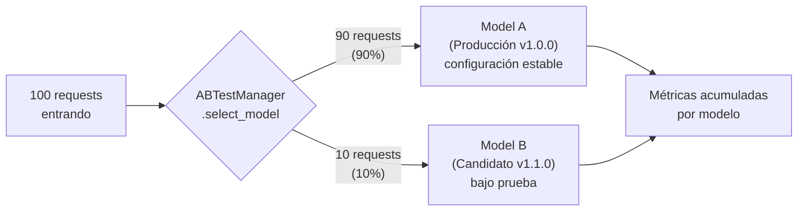
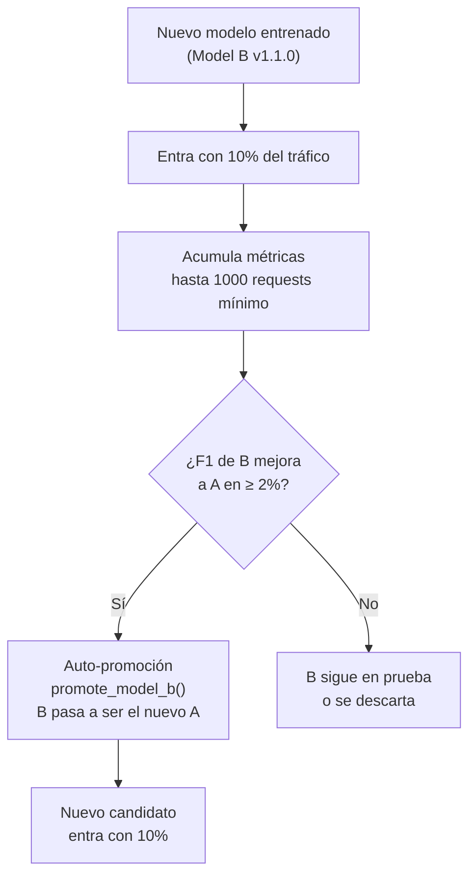
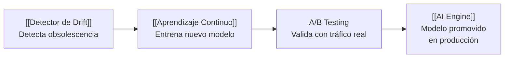

# A/B Testing — ABTestManager

Sistema que permite comparar **dos versiones del modelo ML** de [[AthenAI]] usando tráfico real, sin afectar la producción.

> [!INFO] Idea central
> Antes de reemplazar el modelo de producción por uno nuevo, se prueba el candidato con una pequeña fracción del tráfico real (10%). Si demuestra ser mejor, se promueve automáticamente a producción.

---

## Archivo

`athenai-dashboard/ab_testing.py`

---

## Distribución del tráfico



La selección es **probabilística** — cada request tiene 90% de probabilidad de ir al modelo A y 10% al modelo B.

---

## Métricas que se rastrean por modelo

| Métrica | Descripción |
|---------|-------------|
| `requests` | Total de predicciones realizadas |
| `correct_predictions` | Predicciones correctas (con ground truth) |
| `false_positives` | Benigno real → clasificado como malicioso |
| `false_negatives` | Malicioso real → clasificado como benigno |
| `avg_confidence` | Confianza promedio del modelo |
| `f1_score` | Métrica de evaluación principal |

---

## Ciclo de vida de un modelo candidato



---

## Condiciones para auto-promoción

```python
# ab_testing.py
auto_promote_threshold = 0.02    # Modelo B debe superar a A en ≥ 2% de F1
min_requests_for_promotion = 1000  # Mínimo de requests antes de decidir
```

> [!WARNING] ¿Por qué 1000 requests mínimo?
> Con pocos datos, las diferencias de F1 pueden ser ruido estadístico. 1000 requests dan suficiente significancia estadística para tomar una decisión confiable.

---

## ¿Qué pasa al promover?

```python
def promote_model_b(self):
    # Model B pasa a ser Model A (producción)
    # Model A pasa a ser Model B (ahora es el "antiguo")
    # Las métricas de Model B (nuevo candidato) se resetean
    # El split vuelve a 90/10
```

Es un **swap**, no una copia. El ciclo siempre tiene un modelo estable (90%) y un candidato en prueba (10%).

---

## API para controlar el split

```http
POST /api/ab-testing/traffic-split
Authorization: Bearer <admin_token>

{"model_a_percentage": 80}
# → Model A: 80%, Model B: 20%
```

Validado por `TrafficSplitSchema` (0–100%).

---

## Consultar métricas

```python
stats = ab_test_manager.get_stats()
# {
#   "model_a": {
#     "version": "v1.0.0",
#     "total_requests": 9823,
#     "f1_score": 97.4,
#     "false_negative_rate": 0.12
#   },
#   "model_b": {
#     "version": "v1.1.0",
#     "total_requests": 1091,
#     "f1_score": 98.1,
#     "false_negative_rate": 0.08
#   },
#   "comparison": {
#     "f1_diff": 0.7,
#     "winner": "model_b",
#     "can_auto_promote": false   ← aún no llega al umbral 2%
#   }
# }
```

---

## Relación con otros módulos



---

## Ver también

- [[AI Engine]] — Los modelos que se comparan
- [[Aprendizaje Continuo]] — Genera los modelos candidatos
- [[Detector de Drift]] — Dispara la necesidad de un nuevo candidato
- [[API Backend]] — Endpoint `POST /api/ab-testing/traffic-split`
