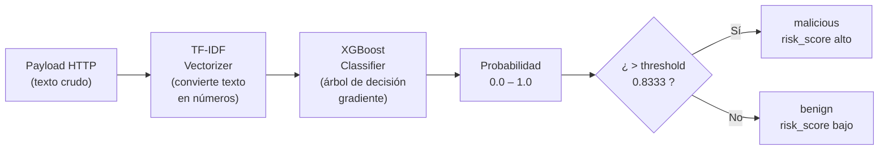
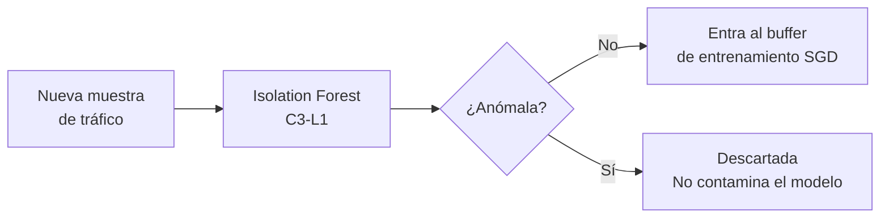

# AI Engine — Clasificador de Amenazas ML

Módulo de inteligencia artificial de [[AthenAI]], implementado en la capa C3 de la [[Arquitectura]].

> [!INFO] Idea central
> El AI Engine lee el **texto del payload HTTP** (lo que viene en el body de un POST, en los parámetros de URL, etc.) y decide si parece un ataque o tráfico normal. Lo hace como un filtro de spam, pero para ciberataques.

---

## Archivos principales

| Archivo | Rol |
|---------|-----|
| `ai_engine.py` | Clasificador XGBoost principal |
| `poisoning_detector.py` | Guard anti-envenenamiento (Isolation Forest C3-L1) |
| `lambda_function_hybrid.py` | UEBA comportamental (Isolation Forest C6) |
| `training/results/metrics.json` | Métricas del modelo entrenado |
| `training/results/threshold_calibration.json` | Threshold óptimo (0.8333) |

---

## Algoritmo 1: XGBoost + TF-IDF (clasificador principal)

### ¿Cómo funciona?



### ¿Qué es TF-IDF?
Convierte texto en vectores numéricos. Las palabras que aparecen mucho en payloads maliciosos (como `SELECT`, `DROP`, `<script>`, `../`) tienen un peso mayor.

### ¿Qué es XGBoost?
Un conjunto de árboles de decisión entrenados secuencialmente, donde cada árbol corrige los errores del anterior. Es el algoritmo favorito en competencias de datos tabulares por su precisión.

### Threshold de decisión

```python
# En producción (ai_engine.py:115):
threshold = 0.999   # muy conservador

# Calibrado con Youden J (threshold_calibration.json):
optimal_threshold = 0.8333
# → mismo F1=99.98% con ambos valores
```

> [!NOTE] ¿Por qué Youden J?
> El índice J de Youden = Sensibilidad + Especificidad - 1. El punto que lo maximiza es el threshold que mejor equilibra "no dejar pasar ataques" (recall) con "no bloquear tráfico legítimo" (precision).

---

## Algoritmo 2: Isolation Forest anti-poisoning (C3-L1)

### ¿Qué problema resuelve?
AthenAI se re-entrena continuamente con tráfico real. Un atacante avanzado podría enviar tráfico malicioso disfrazado de normal para que el modelo "aprenda" que ese patrón es seguro. A esto se le llama **data poisoning**.

### ¿Cómo lo detecta?



El Isolation Forest detecta puntos anómalos **aislándolos** en árboles aleatorios. Una muestra anómala se aísla en pocos pasos; una normal necesita muchos más.

---

## Algoritmo 3: Isolation Forest UEBA (C6 Lambda)

### ¿Qué analiza?
No el contenido del tráfico, sino el **comportamiento del usuario** a lo largo del tiempo.

```python
# lambda_function_hybrid.py:235-255
# función: detect_auth_anomaly_ml()

features = {
    'hour_of_day':          3,      # 3am → inusual
    'day_of_week':          6,      # domingo
    'unusual_location':     1,      # nueva ciudad
    'geo_distance_km':      9000,   # viaje imposible en 2h
    'session_duration_avg': 5       # sesión muy corta
}
# → anomaly_score + severidad HIGH/MEDIUM/LOW
```

### Severidades de salida

| anomaly_score | Severidad |
|---------------|-----------|
| > 0.8 | HIGH |
| 0.5 – 0.8 | MEDIUM |
| < 0.5 | LOW |

---

## Comparativa de modelos entrenados

| Modelo | F1 | Falsos Negativos | ¿Usado? |
|--------|----|----|---------|
| **XGBoost** | 99.98% | **0** | ✅ Producción |
| LR (Logistic Regression) | 99.98% | 1 | No |
| RF (Random Forest) | 99.95% | 2 | No |
| SVM | 94.36% | 84 | No |

> [!DANGER] ¿Por qué SVM es inaceptable?
> SVM tiene 84 Falsos Negativos — 84 ataques reales que pasarían desapercibidos. En un IDS, un Falso Negativo es mucho más costoso que un Falso Positivo.

---

## Uso en el endpoint

```python
# api_backend.py — /api/security/analyze
label, confidence = brain.predict(payload)
risk_score = float(confidence)  # 0.0 – 100.0
# → pasa a Policy Engine.make_decision(risk_score, source_ip, attack_type)
```

---

## Ver también

- [[Arquitectura]] — Posición de C3 y C6 en el sistema
- [[Policy Engine]] — Qué hace con el risk_score
- [[Base de Datos]] — S3 guarda los modelos entrenados
- [[Seguridad]] — Protección contra data poisoning
- [[Aprendizaje Continuo]] — Modelo SGD que se actualiza en tiempo real
- [[Detector de Drift]] — Detecta cuando XGBoost se vuelve obsoleto
- [[A-B Testing]] — Compara versiones antes de promover a producción
