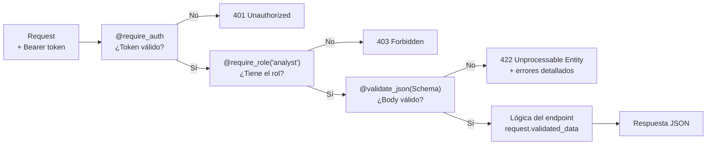

# API Backend — Servidor Flask REST

El corazón del servidor de [[AthenAI]]. Expone todos los endpoints HTTP y coordina los módulos internos.

> [!INFO] Idea central
> El API Backend es el "director de orquesta": recibe cada request HTTP, lo pasa por el pipeline de seguridad (C0→C6), consulta a los módulos especializados ([[AI Engine]], [[Policy Engine]], [[Auth Service]]) y devuelve la respuesta.

---

## Archivo principal

`athenai-dashboard/api_backend.py` — ~2600 líneas (monolítico, sin Flask Blueprints)

---

## Cómo arranca el servidor

### Modo desarrollo (local)
```bash
cd athenai-dashboard
py api_backend.py
# → http://localhost:5000
```

### Modo producción (Gunicorn)
```bash
gunicorn -c gunicorn.conf.py wsgi:app
# → http://0.0.0.0:8000
```

> [!WARNING] Nunca usar Werkzeug en producción
> El servidor de desarrollo de Flask (Werkzeug) no está diseñado para manejar carga real ni es seguro. En producción siempre se usa **Gunicorn** (V-01 corregido). Ver [[Infraestructura]].

---

## Mapa de endpoints

### Autenticación (sin JWT requerido)

| Método | Endpoint | Descripción |
|--------|----------|-------------|
| POST | `/api/auth/login` | Login con username + password → devuelve access_token y refresh_token |
| POST | `/api/auth/register` | Crear cuenta nueva (si `REGISTRATION_ENABLED=true`) |
| POST | `/api/auth/refresh` | Renovar access_token con refresh_token (sin re-login) |

### Monitoreo (JWT requerido)

| Método | Endpoint | Rol mínimo | Descripción |
|--------|----------|-----------|-------------|
| GET | `/api/stats` | viewer | KPIs: total requests, ataques, IPs bloqueadas |
| GET | `/api/alerts` | viewer | Lista de alertas con filtros (limit, offset, severity) |
| GET | `/api/traffic` | viewer | Datos de tráfico para gráficos |
| GET | `/api/health` | — | Estado básico `{"status":"ok"}` (público) |
| GET | `/api/health/full` | admin | Estado completo de todos los servicios |

### Seguridad (JWT requerido)

| Método | Endpoint | Rol mínimo | Descripción |
|--------|----------|-----------|-------------|
| POST | `/api/security/analyze` | analyst | Analizar payload con AI Engine + Policy Engine |
| GET | `/api/blocked-ips` | analyst | Ver IPs bloqueadas |
| POST | `/api/blocked-ips` | admin | Bloquear IP manualmente |
| DELETE | `/api/blocked-ips/<ip>` | admin | Desbloquear IP |
| POST | `/api/whitelist` | admin | Añadir IP a lista blanca |

### Machine Learning (JWT requerido)

| Método | Endpoint | Rol mínimo | Descripción |
|--------|----------|-----------|-------------|
| POST | `/api/ml/predict` | analyst | Predicción en endpoint SageMaker (allowlist) |
| POST | `/api/ml/predict/threat` | analyst | Predicción especializada de amenazas |

---

## Pipeline de un request autenticado



---

## Cabeceras de seguridad en todas las respuestas

Añadidas automáticamente en `after_request`:

```http
Content-Security-Policy: default-src 'self'; script-src 'self' https://cdn.tailwindcss.com ...
Strict-Transport-Security: max-age=63072000; includeSubDomains
X-Frame-Options: DENY
X-Content-Type-Options: nosniff
Referrer-Policy: strict-origin-when-cross-origin
```

El header `Server` se **elimina** para no revelar que el servidor es Flask/Werkzeug.

---

## Respuestas de error uniformes (siempre JSON)

Todos los errores devuelven JSON, nunca HTML de Flask:

```json
// 401 Unauthorized
{"error": "Authentication required"}

// 403 Forbidden
{"error": "Insufficient permissions"}

// 422 Validation Error
{
  "error": "Validation failed",
  "messages": {
    "password": ["La contraseña debe tener mínimo 12 caracteres."]
  }
}

// 429 Too Many Requests
{"error": "Rate limit exceeded. Try again later."}
```

---

## CORS — Cross-Origin Resource Sharing

```python
cors_origins = os.getenv('CORS_ORIGINS', 'http://localhost:3000').split(',')
CORS(app,
     origins=cors_origins,          # Solo orígenes de la lista
     supports_credentials=False,    # No permite cookies cross-origin (V-04)
     vary_header=True               # Vary: Origin siempre presente (V-10)
)
```

> [!NOTE] ¿Por qué supports_credentials=False?
> Si fuera `True`, un sitio malicioso podría hacer requests a la API usando las cookies de sesión del usuario. Con `False`, las credenciales nunca viajan en requests cross-origin.

---

## Ver también

- [[Auth Service]] — Lógica detrás de los endpoints `/api/auth/*`
- [[Policy Engine]] — Lógica detrás de `/api/security/analyze`
- [[Seguridad]] — Todos los parches de seguridad aplicados
- [[Infraestructura]] — Gunicorn y configuración de producción
