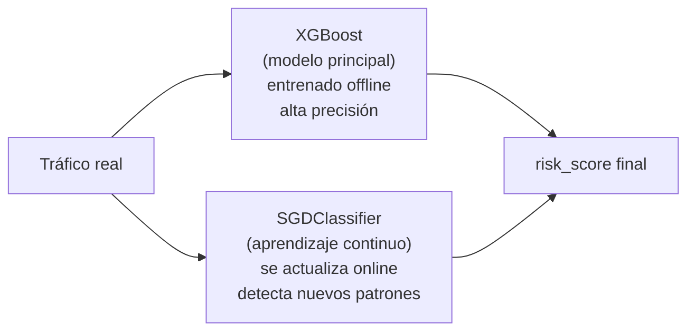
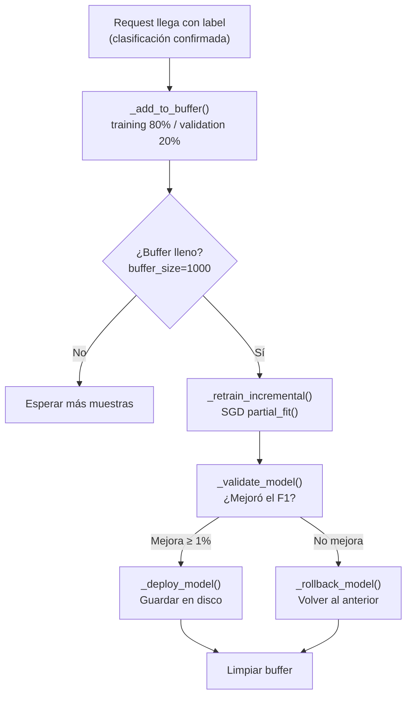

# Aprendizaje Continuo — ContinuousLearningEngine

Módulo que permite a [[AthenAI]] **aprender de nuevos ataques en tiempo real**, sin necesidad de re-entrenar el modelo completo desde cero.

> [!INFO] Idea central
> El modelo XGBoost del [[AI Engine]] se entrena una vez con datos históricos. El `ContinuousLearningEngine` es un segundo modelo más ligero (SGDClassifier) que se actualiza continuamente con el tráfico real del servidor — para detectar ataques de día cero que no existían cuando se entrenó XGBoost.

---

## Archivo

`athenai-dashboard/continuous_learning_engine.py`

---

## ¿Por qué dos modelos?



| Característica | XGBoost | SGDClassifier (CLE) |
|----------------|---------|---------------------|
| Entrenamiento | Offline, batch | Online, incremental |
| Velocidad de actualización | Horas/días | Minutos |
| Precisión en datos conocidos | 99.98% F1 | Menor |
| Detecta ataques nuevos | No (hasta re-entrenamiento) | Sí |

---

## Ciclo de vida del aprendizaje



---

## Configuración principal

```python
ContinuousLearningEngine(
    buffer_size=1000,         # Muestras antes de re-entrenar
    validation_split=0.2,     # 20% para validación (200 muestras)
    min_improvement=0.01,     # Mínimo 1% de mejora en F1 para desplegar
    model_path='models/online_model.pkl'
)
```

---

## Protección anti-data-poisoning

Antes de que una muestra entre al buffer, pasa por el **Isolation Forest C3-L1** (`poisoning_detector.py`). Si la muestra es anómala, se descarta y nunca contamina el modelo online.

> [!DANGER] ¿Qué pasa sin esta protección?
> Un atacante podría enviar deliberadamente tráfico malicioso con etiqueta "benigno" para que el modelo aprenda que ese tipo de ataque es normal. En el siguiente re-entrenamiento, el ataque ya no sería detectado. El Isolation Forest bloquea este vector.

---

## Rollback automático

Si el nuevo modelo empeora respecto al anterior, el sistema hace **rollback automático**:

```python
# Antes de re-entrenar:
self.previous_model = pickle.loads(pickle.dumps(self.online_model))  # copia profunda

# Si la validación falla:
self.online_model = self.previous_model  # restaurar
self.stats['rollbacks'] += 1
```

Esto garantiza que el sistema nunca degrada su capacidad de detección.

---

## Estadísticas en tiempo real

```python
learner.get_stats()
# {
#   "total_predictions": 15420,
#   "total_retrains": 12,
#   "successful_deploys": 9,
#   "rollbacks": 3,
#   "buffer_size": 456,
#   "last_performance": {
#     "f1_score": 0.9712,
#     "precision": 0.9834,
#     "recall": 0.9594
#   }
# }
```

---

## Ver también

- [[AI Engine]] — Modelo XGBoost principal (entrenamiento offline)
- [[Detector de Drift]] — Detecta cuando el modelo necesita re-entrenamiento completo
- [[A/B Testing]] — Compara versiones del modelo antes de promover
- [[Arquitectura]] — Posición en la capa C3
