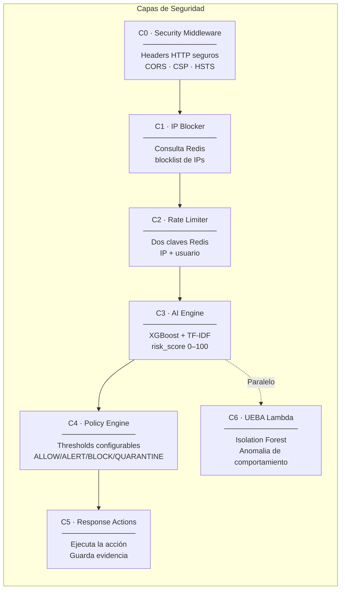

# Arquitectura — Capas C0 a C6

[[AthenAI]] usa un diseño en capas donde **cada capa tiene una sola responsabilidad**. Si una capa falla o se salta, las siguientes siguen funcionando como red de seguridad.

> [!TIP] Principio de defensa en profundidad
> Ninguna capa confía en que la anterior lo hizo todo bien. Cada una valida por su cuenta. Esto se llama "Defense in Depth".

---

## Diagrama de capas con responsabilidades



---

## Descripción de cada capa

### C0 — Security Middleware
**¿Qué hace?** Añade cabeceras de seguridad HTTP a **todas** las respuestas antes de que salgan del servidor.

**Ejemplo de cabeceras que añade:**
```
Content-Security-Policy: default-src 'self'; script-src ...
Strict-Transport-Security: max-age=63072000
X-Frame-Options: DENY
X-Content-Type-Options: nosniff
```

**¿Por qué importa?** Sin estas cabeceras, un navegador podría ejecutar scripts inyectados por un atacante (XSS), cargar la app dentro de un iframe fraudulento, o ser engañado sobre el tipo de contenido.

---

### C1 — IP Blocker
**¿Qué hace?** Antes de procesar cualquier request, consulta Redis para ver si la IP de origen está en la lista negra.

**Clave Redis:** `blocked:{ip}` con TTL configurable (1 seg – 7 días)

**¿Por qué Redis y no la base de datos?** Redis responde en < 1 ms. Una consulta a DynamoDB tomaría 5–20 ms por request. Con miles de requests por segundo, la diferencia es enorme.

---

### C2 — Rate Limiter
**¿Qué hace?** Limita cuántos intentos de autenticación puede hacer un cliente.

**Dos claves independientes** (evita que un atacante pruebe desde IPs distintas con el mismo usuario):
```
rl:login:ip:{ip}       → máx. 10 intentos / 15 min
rl:login:user:{user}   → máx. 5 intentos / 15 min
rl:register:{ip}       → máx. 5 registros / hora
```

> [!WARNING] Por qué dos claves
> Si solo bloqueáramos por IP, un atacante con muchas IPs (botnet) podría seguir probando contraseñas. Si solo bloqueáramos por usuario, no detendríamos ataques de password spray a múltiples cuentas desde una IP.

---

### C3 — AI Engine (XGBoost)
**¿Qué hace?** Analiza el **contenido del payload** HTTP y devuelve un `risk_score` entre 0 y 100.

**Pipeline:**
```
payload (texto) → TF-IDF (vectoriza) → XGBoost (clasifica) → risk_score
```

**Threshold de decisión:** 0.8333 (calibrado con Youden J — el punto que maximiza sensibilidad + especificidad)

Ver [[AI Engine]] para detalles completos.

---

### C4 — Policy Engine
**¿Qué hace?** Recibe el `risk_score` y lo convierte en una **acción ejecutable**.

| risk_score | Acción | Significado |
|------------|--------|-------------|
| 0 – 25 | ALLOW | Tráfico normal, pasa |
| 25 – 50 | ALERT | Sospechoso, loguear y avisar |
| 50 – 75 | BLOCK | Bloquear request y IP temporalmente |
| 75 – 100 | QUARANTINE | Bloquear + guardar evidencia forense en S3 |

Los thresholds son **configurables en caliente** sin reiniciar el servidor. Ver [[Policy Engine]].

---

### C5 — Response Actions
**¿Qué hace?** Ejecuta la acción que decidió C4:
- Guarda el log en DynamoDB (`traffic_logs` + `alerts`)
- Si es BLOCK/QUARANTINE → añade IP a Redis blocklist
- Si es QUARANTINE → sube evidencia a S3

---

### C6 — UEBA Lambda (Isolation Forest)
**¿Qué hace?** Analiza el **comportamiento del usuario**, no el contenido del tráfico.

**Ejemplo:** un usuario que normalmente se conecta desde Madrid a las 9am y de repente se conecta desde China a las 3am → anomalía de comportamiento.

**Features analizados:**
- `hour_of_day` — ¿Hora inusual?
- `day_of_week` — ¿Día inusual?
- `unusual_location` — ¿Ubicación nueva?
- `geo_distance_km` — ¿Viaje imposible?
- `session_duration_avg` — ¿Sesión mucho más corta o larga que lo normal?

---

## Sub-capas ML dentro de C3

| Sub-capa | Algoritmo | Rol específico |
|----------|-----------|----------------|
| C3-L1 | Isolation Forest | Detecta muestras envenenadas antes de que entren al entrenamiento continuo |
| C3-L3 | XGBoost + TF-IDF | Clasifica el payload como benigno o malicioso |

> [!NOTE] ¿Qué es data poisoning?
> Si un atacante sabe que el modelo se re-entrena con tráfico real, puede inyectar tráfico malicioso disfrazado de normal para "envenenar" el modelo y que deje de detectarlo. El Isolation Forest en C3-L1 detecta esas muestras antes de que lleguen al buffer de entrenamiento.

---

## Ver también

- [[AI Engine]] — Implementación de C3 y C6
- [[Policy Engine]] — Lógica de C4
- [[Infraestructura]] — Dónde corre cada capa
- [[AthenAI]] — Visión general del sistema
