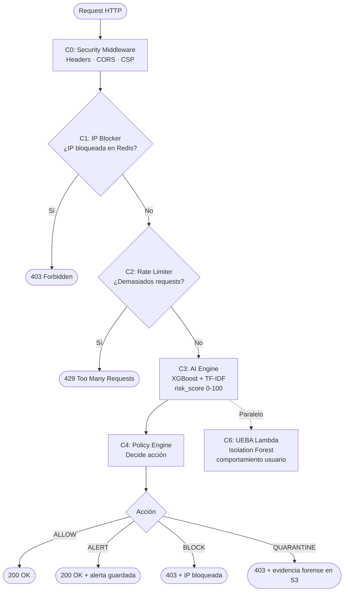

# AthenAI — Sistema de Detección de Intrusos (IDS)

> [!INFO] ¿Qué es AthenAI?
> AthenAI es un **guardia de seguridad digital** para aplicaciones web. Analiza cada petición HTTP que llega al servidor, decide si es legítima o maliciosa, y actúa en consecuencia — todo en milisegundos y usando Machine Learning.
> 
> Desarrollado como proyecto de **Tesis de Maestría** (Seminario de Tesis, Junio 2026).

---

## Analogía simple

Imagina un edificio de oficinas:

| Edificio | AthenAI |
|----------|---------|
| Portero (revisa quién entra) | [[Security Middleware\|Security Middleware C0]] |
| Lista negra de visitantes bloqueados | [[IP Blocker\|IP Blocker C1]] |
| Torniquete con límite de velocidad | [[Rate Limiter\|Rate Limiter C2]] |
| Detector de metales con IA | [[AI Engine]] |
| Jefe de seguridad que decide qué hacer | [[Policy Engine]] |
| Equipo de respuesta (llama policía, saca al intruso) | Response Actions C5 |
| Cámara de comportamiento inusual | UEBA C6 |

---

## Flujo completo de una petición

---

## Módulos del sistema

| Módulo | Qué hace | Nota detallada |
|--------|----------|----------------|
| Security Middleware | Añade headers de seguridad a toda respuesta | [[API Backend]] |
| IP Blocker | Bloquea IPs en Redis | [[Base de Datos]] |
| Rate Limiter | Limita intentos de login por IP y usuario | [[Auth Service]] |
| AI Engine | Clasifica tráfico como benigno/malicioso | [[AI Engine]] |
| Policy Engine | Convierte risk_score en acción concreta | [[Policy Engine]] |
| Auth Service | Login, registro, tokens JWT | [[Auth Service]] |
| Frontend | Dashboard visual React + páginas HTML | [[Frontend]] |
| Base de Datos | DynamoDB + SQLite + Redis | [[Base de Datos]] |
| Infraestructura | Docker, LocalStack, Gunicorn | [[Infraestructura]] |
| Seguridad | Vulnerabilidades corregidas (V-01 a V-12) | [[Seguridad]] |
| Response Actions | Ejecuta ALLOW/ALERT/BLOCK/RATE_LIMIT | [[Response Actions]] |
| Aprendizaje Continuo | Re-entrenamiento incremental en tiempo real | [[Aprendizaje Continuo]] |
| Detector de Drift | Detecta obsolescencia del modelo | [[Detector de Drift]] |
| A/B Testing | Compara modelos con tráfico real | [[A-B Testing]] |

---

## Métricas del modelo ML

| Modelo | Accuracy | F1 | Falsos Negativos |
|--------|----------|----|-----------------|
| **XGBoost** ✅ | 99.96% | 99.98% | 0 |
| LR | — | 99.98% | 1 |
| RF | — | 99.95% | 2 |
| SVM | — | 94.36% | 84 |

> [!SUCCESS] XGBoost con 0 Falsos Negativos
> Ninguna amenaza real pasó desapercibida en el conjunto de prueba. Este es el objetivo crítico de un IDS: que el modelo no deje pasar ataques.

---

## Arquitectura de capas

Ver [[Arquitectura]] para el diagrama completo C0–C6.
