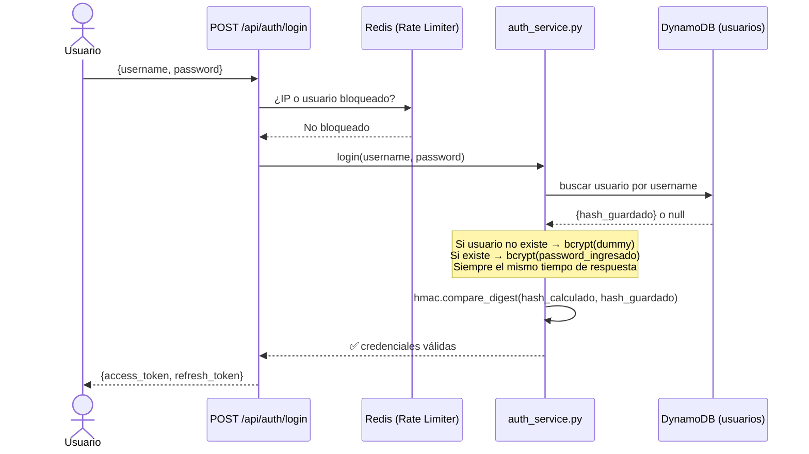
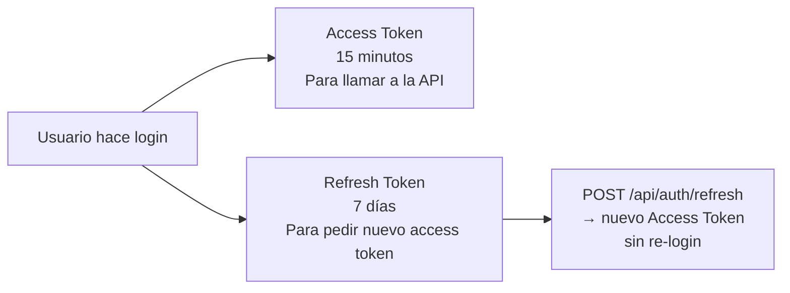

# Auth Service — Autenticación JWT + bcrypt

Módulo que gestiona **quién puede entrar** al sistema [[AthenAI]] y **cómo se verifica su identidad**.

> [!INFO] Idea central
> El Auth Service usa JWT (tokens firmados) para no tener que guardar sesiones en el servidor. Cada request lleva su token, el servidor lo verifica criptográficamente y sabe quién es el usuario sin consultar ninguna base de datos.

---

## Archivo principal

`athenai-dashboard/auth_service.py`

---

## Flujo completo de login



---

## JWT — ¿Qué es y qué contiene?

Un JWT tiene 3 partes separadas por puntos: `header.payload.firma`

### Claims de seguridad incluidos

```json
{
  "iss": "athenai",
  "aud": "athenai-dashboard",
  "jti": "xK9mPqR2vL8nT4wA",
  "nbf": 1715400000,
  "iat": 1715400000,
  "exp": 1715400900,
  "sub": "user_id_123",
  "role": "analyst"
}
```

| Claim | Significado | ¿Para qué sirve? |
|-------|-------------|-----------------|
| `iss` | Emisor = `athenai` | Evita que tokens de otro sistema se usen aquí |
| `aud` | Audiencia = `athenai-dashboard` | El token solo sirve para este servicio |
| `jti` | ID único del token | Permite revocar un token específico |
| `nbf` | No válido antes de... | Evita uso de tokens "del futuro" |
| `exp` | Expiración | Access: 15 min · Refresh: 7 días |

> [!WARNING] ¿Por qué no usar solo `exp`?
> Sin `iss` y `aud`, un atacante podría tomar un token JWT de otro servicio (ej. un foro web) y usarlo en AthenAI si los dos usan la misma clave secreta. `iss` y `aud` evitan este "token confusion attack".

---

## Tipos de token



---

## bcrypt + Protección contra Timing Oracle (V-NEW-01)

### ¿Qué es un Timing Oracle?

Si el servidor responde más rápido cuando el usuario **no existe** (porque omite el hash) que cuando **sí existe** (porque calcula bcrypt), un atacante puede medir tiempos de respuesta para enumerar usuarios válidos.

### Solución implementada

```python
# auth_service.py
_DUMMY_BCRYPT_HASH = bcrypt.hashpw(b"dummy_constant", bcrypt.gensalt())

def login(username, password):
    user = db.get_user(username)

    if user is None:
        # Usuario no existe → bcrypt con hash dummy igualmente
        # El atacante NO puede saber si el usuario existe por el tiempo
        bcrypt.checkpw(password.encode(), _DUMMY_BCRYPT_HASH)
        return None, "Credenciales inválidas"

    # Usuario existe → bcrypt real
    match = bcrypt.checkpw(password.encode(), user['password_hash'])

    # Comparación final siempre en tiempo constante
    return hmac.compare_digest(str(match), "True"), ...
```

> [!SUCCESS] Resultado
> El tiempo de respuesta es idéntico tanto si el usuario existe como si no. Un atacante no puede enumerar usuarios midiendo tiempos.

---

## Rate Limiting de autenticación (Redis)

Dos claves independientes para cubrir distintos vectores de ataque:

| Clave Redis | Límite | Protege contra |
|-------------|--------|----------------|
| `rl:login:ip:{ip}` | 10 intentos / 15 min | Fuerza bruta desde una IP |
| `rl:login:user:{user}` | 5 intentos / 15 min | Password spray (muchas IPs, mismo usuario) |
| `rl:register:{ip}` | 5 registros / hora | Creación masiva de cuentas |

---

## Validación de contraseña en registro (V-07)

La contraseña debe cumplir **todos** los requisitos:

```
✅ Mínimo 12 caracteres
✅ Al menos 1 mayúscula (A-Z)
✅ Al menos 1 minúscula (a-z)
✅ Al menos 1 dígito (0-9)
✅ Al menos 1 símbolo (!@#$%^&*...)
✅ Máximo 128 caracteres (evita DoS por hash de strings enormes)
```

> [!NOTE] ¿Por qué máximo 128?
> bcrypt procesa hasta 72 bytes. Un payload de 1 MB como contraseña haría que el servidor calculara bcrypt por segundos, lo que puede usarse como ataque DoS. El límite de 128 chars lo previene.

---

## Roles del sistema

| Rol | Permisos |
|-----|----------|
| `viewer` | Solo lectura (stats, alertas, tráfico) |
| `analyst` | viewer + analizar requests + predicciones ML |
| `admin` | analyst + gestionar IPs + health completo + thresholds |

---

## Ver también

- [[API Backend]] — Endpoints `/api/auth/login`, `/api/auth/refresh`, `/api/auth/register`
- [[Seguridad]] — V-03 (JWT claims), V-05 (oracle login), V-07 (complejidad), V-NEW-01 (timing)
- [[Base de Datos]] — Tabla `users` en DynamoDB
