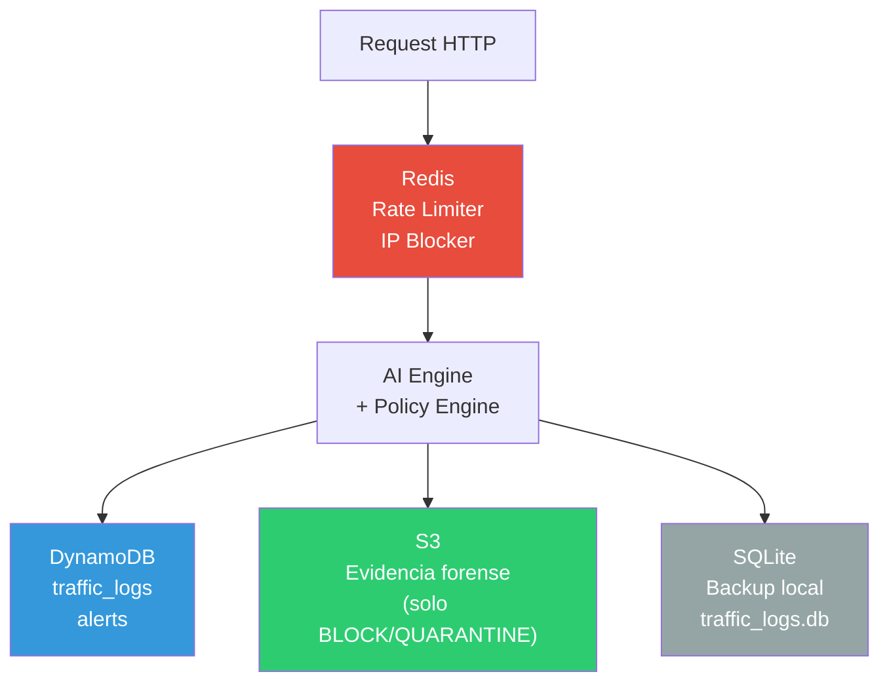

# Base de Datos — DynamoDB · SQLite · Redis

[[AthenAI]] usa **tres sistemas de persistencia** con roles completamente distintos. Ninguno puede reemplazar al otro.

> [!INFO] Regla simple para recordar
> - **Redis** → velocidad (milisegundos, en memoria)
> - **DynamoDB** → persistencia operacional (logs, alertas, usuarios)
> - **SQLite** → backup local (cuando DynamoDB no está disponible)
> - **S3** → evidencia forense (archivos grandes, largo plazo)

---

## Diagrama de flujo de datos



---

## Redis (caché de tiempo real)

- **Host:** `100.108.127.116:6379` (servidor remoto via Tailscale)
- **Por qué Redis:** responde en < 1 ms. Ideal para decisiones que se toman en cada request.

### Claves usadas

| Clave | TTL | Propósito |
|-------|-----|-----------|
| `blocked:{ip}` | Configurable (1s – 7 días) | IP está bloqueada → C1 la rechaza |
| `rl:login:ip:{ip}` | 15 minutos | Contador de intentos de login por IP |
| `rl:login:user:{user}` | 15 minutos | Contador de intentos de login por usuario |
| `rl:register:{ip}` | 1 hora | Contador de registros por IP |
| `whitelist:{ip}` | Sin TTL | IP de confianza → salta C1 |

> [!TIP] ¿Qué pasa si Redis no está disponible?
> El sistema falla de forma "cerrada" (fail-closed): si no puede consultar Redis, bloquea la request en lugar de dejarla pasar. Es más seguro que dejar pasar todo.

---

## DynamoDB (LocalStack)

Emulado localmente con **LocalStack** en `http://100.108.127.116:4566`.

En producción real se usaría **AWS DynamoDB** cambiando el endpoint en `config.py`.

### 7 tablas

| Tabla | Clave primaria | Contenido |
|-------|----------------|-----------|
| `traffic_logs` | `log_id` (UUID) | Cada request analizado: IP, método, path, risk_score, acción |
| `alerts` | `alert_id` | Eventos ALERT y BLOCK con severidad |
| `blocked_ips` | `ip` | IPs bloqueadas con razón, duración, timestamp |
| `users` | `user_id` | Usuarios del sistema: username, hash bcrypt, rol, email |
| `whitelist` | `ip` | IPs de confianza permanente |
| `evidence` | `evidence_id` | Metadata de evidencias forenses (referencia al S3 object) |
| `ml_results` | `result_id` | Resultados históricos de predicciones ML |

### Ejemplo de registro en traffic_logs

```json
{
  "log_id": "550e8400-e29b-41d4-a716-446655440000",
  "source_ip": "203.0.113.42",
  "method": "POST",
  "path": "/api/login",
  "risk_score": 87.3,
  "attack_type": "sql_injection",
  "action_taken": "QUARANTINE",
  "status_code": 403,
  "timestamp": "2026-05-11T03:15:22.410Z"
}
```

---

## S3 (LocalStack) — Evidencia forense

4 buckets para diferentes tipos de datos:

| Bucket | Uso |
|--------|-----|
| `athenai-evidence` | Payloads y contexto de requests BLOCK/QUARANTINE |
| `athenai-models` | Modelos XGBoost e Isolation Forest entrenados |
| `athenai-logs` | Logs archivados (rotación diaria) |
| `athenai-backups` | Backups de configuración |

> [!NOTE] ¿Por qué guardar evidencia en S3 y no en DynamoDB?
> DynamoDB tiene un límite de 400 KB por item. Un payload de ataque puede ser mucho mayor. S3 maneja archivos de cualquier tamaño sin límite.

---

## SQLite — Backup local

- **Archivo:** `athenai-dashboard/traffic_logs.db`
- **ORM:** SQLAlchemy
- **Rol:** backup cuando DynamoDB (LocalStack) no está disponible

### Campo especial: `is_test_attack`

```python
# models.py
is_test_attack = Column(Boolean, index=True, default=False)
# True cuando el request viene de la IP 100.108.127.116 (entorno de pruebas)
```

En el dashboard, los test attacks aparecen con fondo rojo y badge "🔴 TEST ATTACK".

---

## Ver también

- [[Infraestructura]] — Cómo levantar LocalStack y Redis
- [[Auth Service]] — Tabla `users`
- [[Policy Engine]] — Inserción de logs y alertas
- [[AI Engine]] — S3 para modelos entrenados
