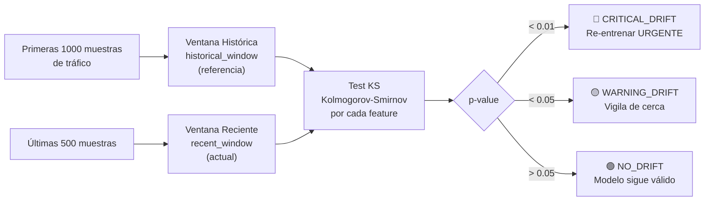

# Detector de Drift — DriftDetector

Módulo que detecta cuándo el **comportamiento del tráfico ha cambiado tanto** que el modelo de ML de [[AthenAI]] se ha vuelto obsoleto y necesita re-entrenamiento completo.

> [!INFO] ¿Qué es el concept drift?
> Imagina que entrenas un modelo en enero para detectar ataques SQL injection con ciertos patrones. En junio, los atacantes cambian sus técnicas y usan patrones completamente distintos. El modelo sigue "funcionando" pero ya no detecta los ataques nuevos — su distribución de datos cambió. Eso es **concept drift**.

---

## Archivo

`athenai-dashboard/drift_detector.py`

---

## ¿Cómo detecta el cambio?



---

## Test de Kolmogorov-Smirnov (KS)

El test KS compara dos distribuciones estadísticas y devuelve un **p-value**:
- **p-value pequeño** (< 0.05) → las distribuciones son diferentes → hay drift
- **p-value grande** (> 0.05) → las distribuciones son similares → no hay drift

```python
# drift_detector.py
from scipy import stats

_, p_value = stats.ks_2samp(
    historical_features[:, i],   # distribución de referencia
    recent_features[:, i]         # distribución actual
)
# Si p_value < 0.01 → CRITICAL DRIFT
```

Se aplica a **cada feature individualmente** y se toma el p-value mínimo (el más alarmante).

---

## Configuración de umbrales

```python
DriftDetector(
    window_size=1000,          # Tamaño de ventana histórica
    warning_threshold=0.05,    # p < 0.05 → WARNING
    critical_threshold=0.01    # p < 0.01 → CRITICAL
)
```

---

## Tipos de respuesta

| Tipo | p-value | Acción recomendada |
|------|---------|-------------------|
| `NO_DRIFT` | > 0.05 | Continuar normalmente |
| `WARNING_DRIFT` | 0.01 – 0.05 | Activar [[Aprendizaje Continuo]] más agresivo |
| `CRITICAL_DRIFT` | < 0.01 | Re-entrenar XGBoost desde cero con datos nuevos |

---

## Ejemplo real de drift

```
Enero: Los ataques SQL injection usan: "' OR 1=1 --"
       Distribución de features: normal alrededor de ciertos vectores TF-IDF

Junio: Nuevas técnicas usan: "' OR 'x'='x" y codificación Unicode
       Distribución de features: desplazada 2 desviaciones estándar

→ KS test detecta: p_value = 0.003 < 0.01
→ CRITICAL_DRIFT: re-entrenar modelo
```

---

## Reset de ventanas

Después de un re-entrenamiento completo, las ventanas se resetean para que el "baseline" histórico sea el tráfico actual:

```python
detector.reset_windows()
# Mueve ventana reciente a histórica
# Limpia ventana reciente
# El nuevo modelo tiene un nuevo punto de referencia
```

---

## Ver también

- [[Aprendizaje Continuo]] — Responde al drift con re-entrenamiento incremental
- [[AI Engine]] — El modelo que puede volverse obsoleto
- [[A/B Testing]] — Valida el nuevo modelo antes de desplegarlo en producción
