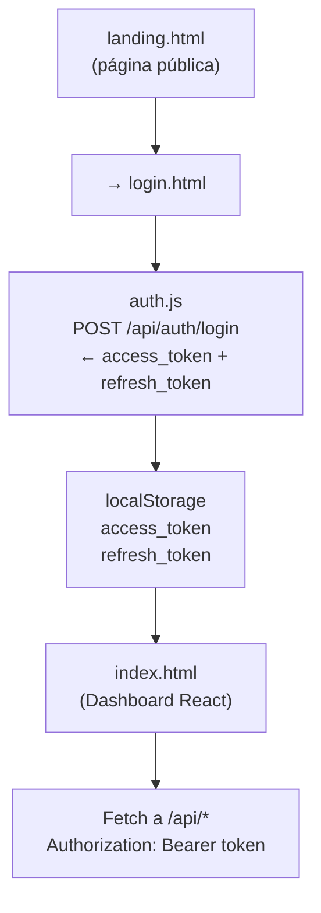

# Frontend — Dashboard · Login · Landing

Capa de presentación de [[AthenAI]]. Todo lo que el usuario ve en el navegador.

> [!INFO] Stack sin bundler
> El frontend usa React 18 y Tailwind CSS cargados directamente desde CDN, sin Webpack ni Vite. Esto simplifica el desarrollo (no hay build step) pero tiene implicaciones en producción.

---

## Archivos

| Archivo | Ruta | Qué es |
|---------|------|--------|
| `login.html` | `/login.html` | Página de autenticación |
| `landing.html` | `/` | Landing page pública (marketing) |
| `index.html` | `/index.html` | Dashboard principal (React SPA) |
| `auth.js` | JS incluido en index.html | Servicio de autenticación del cliente |

---

## Arquitectura del Frontend



---

## Flujo de autenticación en el cliente

```javascript
// auth.js — Login
async function login(username, password) {
    const res = await fetch('/api/auth/login', {
        method: 'POST',
        headers: {'Content-Type': 'application/json'},
        body: JSON.stringify({username, password})
    });
    const data = await res.json();
    localStorage.setItem('access_token', data.access_token);
    localStorage.setItem('refresh_token', data.refresh_token);
}

// Cada request al API
headers: {
    'Authorization': `Bearer ${localStorage.getItem('access_token')}`
}
```

> [!WARNING] Token en localStorage
> Guardar tokens en `localStorage` los expone a ataques XSS. El CSP configurado mitiga esto bloqueando scripts externos no autorizados. En una versión de producción avanzada se recomendaría usar cookies `HttpOnly; SameSite=Strict`.

---

## Pestañas del Dashboard

| Pestaña | Ícono | Datos que muestra |
|---------|-------|-------------------|
| Overview | 📊 | KPIs: requests totales, ataques, IPs bloqueadas |
| Traffic | 📈 | Gráfico de tráfico en tiempo real (actualiza cada 5s) |
| Alerts | 🔔 | Lista de alertas con severidad y filtros |
| Traffic Logs | 💾 | Logs detallados con resaltado de test attacks 🔴 |
| Blocked IPs | 🚫 | IPs bloqueadas con duración y razón |
| ML Analytics | 🤖 | Resultados de predicciones del AI Engine |

---

## Content Security Policy (CSP)

El CSP le dice al navegador **qué recursos puede cargar** la página. Bloquea cualquier cosa no listada.

```
Content-Security-Policy:
  default-src 'self';
  script-src  'self' 'unsafe-inline' https://cdn.tailwindcss.com https://unpkg.com;
  style-src   'self' 'unsafe-inline' https://cdn.tailwindcss.com https://fonts.googleapis.com;
  font-src    'self' https://fonts.gstatic.com;
  img-src     'self' data:;
  connect-src 'self';
```

> [!NOTE] ¿Por qué `unsafe-inline`?
> React 18 vía CDN con Babel standalone requiere ejecutar JSX inline. En una versión con bundler esto desaparecería y se tendría un CSP más estricto.

---

## Tailwind CSS vía CDN

```html
<!-- Versión fija para evitar cambios inesperados -->
<script src="https://cdn.tailwindcss.com/3.4.1"
        crossorigin="anonymous"></script>
```

> [!TIP] ¿Por qué la versión fija (3.4.1)?
> Sin versión fija (`cdn.tailwindcss.com` sin número) Tailwind podría actualizarse automáticamente y romper el diseño. La versión fija garantiza reproducibilidad.
> 
> **Para producción real:** compilar Tailwind localmente con `npx tailwindcss build` y servir el CSS estático. Así también se puede añadir SRI (Subresource Integrity).

---

## HSTS — Forzar HTTPS

```
Strict-Transport-Security: max-age=63072000; includeSubDomains
```

Después de la primera visita HTTPS, el navegador **nunca más** intentará conectar por HTTP (válido por 2 años). Previene ataques de downgrade.

---

## Ver también

- [[API Backend]] — Endpoints que consume el dashboard
- [[Auth Service]] — Flujo JWT completo en el servidor
- [[Seguridad]] — CSP, HSTS, X-Frame-Options aplicados
