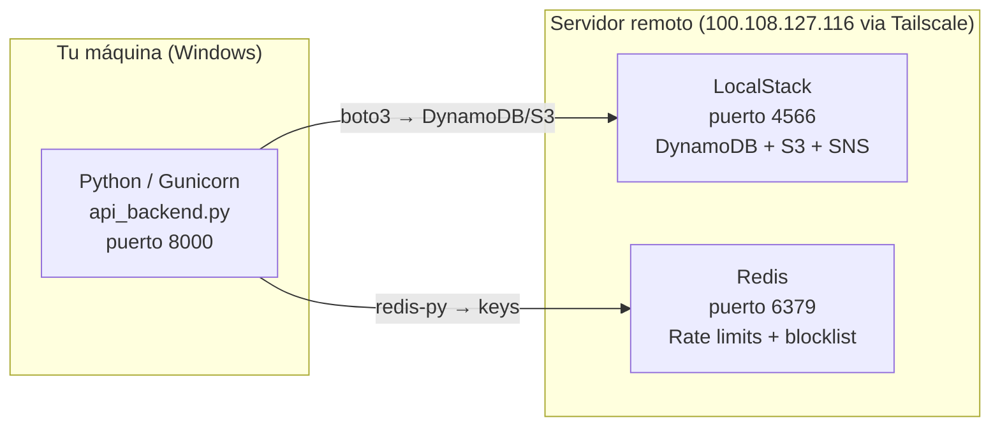

# Infraestructura — Docker · LocalStack · Redis · Gunicorn

Todo lo que necesitas para **levantar AthenAI** desde cero.

> [!INFO] Arquitectura de entorno
> El código Python corre en Windows (dev) o en un contenedor Docker (prod). Los servicios de datos (LocalStack + Redis) corren en un servidor Linux remoto accesible via Tailscale.

---

## Mapa del entorno



---

## Servidor de aplicación

### Desarrollo (rápido para probar)

```powershell
cd "prubas AthenAI\athenai-dashboard"
$env:PYTHONUTF8 = "1"
py api_backend.py
# Abre: http://localhost:5000
```

### Producción (Gunicorn)

```bash
gunicorn -c gunicorn.conf.py wsgi:app
```

**`gunicorn.conf.py`** — configuración clave:

```python
bind = '0.0.0.0:8000'
workers = cpu_count * 2 + 1   # ej: 4 CPUs → 9 workers
threads = 2
worker_class = 'gthread'       # threads dentro de cada worker
forwarded_allow_ips = '127.0.0.1'  # solo Nginx local puede enviar XFF
```

> [!NOTE] ¿Por qué `workers = cpu_count * 2 + 1`?
> Es la fórmula recomendada por Gunicorn para workloads I/O-bound (llamadas a DynamoDB, Redis). Los workers extra compensan el tiempo que pasan esperando respuestas de red.

---

## LocalStack — AWS simulado

LocalStack corre en Docker en el servidor remoto y simula los servicios de AWS: DynamoDB, S3, SNS, SQS.

### Levantar el contenedor

```bash
# En el servidor remoto (100.108.127.116)
docker run -d \
  -p 4566:4566 \
  -p 4510-4559:4510-4559 \
  --name localstack \
  localstack/localstack
```

### Verificar que está corriendo

```bash
curl http://100.108.127.116:4566/_localstack/health
# {"services": {"dynamodb": "available", "s3": "available", ...}}
```

> [!WARNING] Error común: puerto no expuesto
> Si el contenedor se creó sin `-p 4566:4566`, el puerto es interno al Docker y no accesible desde fuera. Hay que recrear el contenedor con los flags `-p`.

---

## Docker — Imagen de producción

El `Dockerfile` está en la raíz del proyecto:

```dockerfile
FROM python:3.13-slim

# Usuario no-root (buena práctica de seguridad)
RUN useradd -u 10001 -m athenai
USER athenai

WORKDIR /app
COPY athenai-dashboard/ .
RUN pip install -r requirements.txt

ENV TRUSTED_PROXY_HOPS=0

CMD ["gunicorn", "-c", "gunicorn.conf.py", "wsgi:app"]
```

> [!TIP] ¿Por qué usuario no-root?
> Si hay una vulnerabilidad de ejecución remota de código en Flask, el atacante obtiene permisos del proceso. Con usuario no-root (uid 10001) no puede escribir en `/etc`, instalar software, ni leer archivos del sistema.

### Construir y correr

```bash
docker build -t athenai .
docker run -d \
  -p 8000:8000 \
  -e REMOTE_SERVER_IP=100.108.127.116 \
  -e SECRET_KEY=tu_clave_secreta \
  --name athenai \
  athenai
```

---

## Variables de entorno (.env)

| Variable | Ejemplo | Descripción |
|----------|---------|-------------|
| `REMOTE_SERVER_IP` | `100.108.127.116` | IP del servidor con LocalStack y Redis |
| `SECRET_KEY` | `abc123...` | Clave para firmar tokens JWT (mínimo 32 chars) |
| `CORS_ORIGINS` | `http://localhost:3000` | Orígenes permitidos en CORS (comma-separated) |
| `TRUSTED_PROXY_HOPS` | `0` | 0 = sin proxy; 1 = Nginx delante |
| `REGISTRATION_ENABLED` | `true` | Habilitar registro de usuarios |

> [!DANGER] Nunca commitear el .env
> El archivo `.env` contiene la clave JWT (`SECRET_KEY`). Si se sube a GitHub, cualquiera puede firmar sus propios tokens y suplantar a cualquier usuario. Está en `.gitignore`.

---

## Proxy inverso (producción real)

Para exponer AthenAI en internet se recomienda Nginx delante de Gunicorn:

```
Internet → Nginx (443 HTTPS) → Gunicorn (8000) → Flask
```

```nginx
location / {
    proxy_pass http://127.0.0.1:8000;
    proxy_set_header X-Forwarded-For $remote_addr;
    proxy_set_header X-Forwarded-Proto $scheme;
}
```

Con Nginx, configurar `TRUSTED_PROXY_HOPS=1` para que Flask confíe en el XFF que envía Nginx.

---

## Ver también

- [[Base de Datos]] — Qué guarda cada servicio (DynamoDB, Redis, S3)
- [[API Backend]] — Endpoints y configuración WSGI
- [[Seguridad]] — V-01 (Gunicorn vs Werkzeug), V-08 (XFF/ProxyFix)
