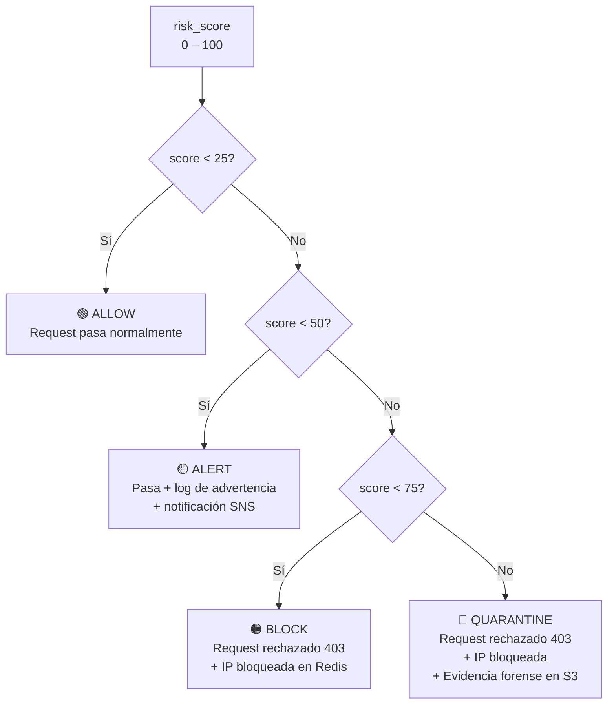
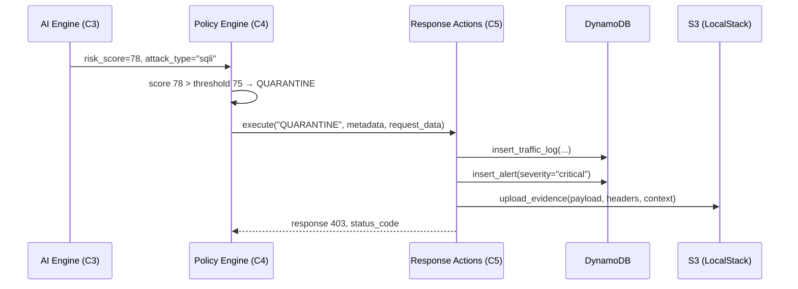

# Policy Engine — Motor de Decisiones C4

La capa C4 de la [[Arquitectura]] de [[AthenAI]]. Recibe el `risk_score` del [[AI Engine]] y decide **qué hacer** con ese request.

> [!INFO] Idea central
> El Policy Engine es como un juez. El AI Engine le dice "este request tiene un 78% de probabilidad de ser malicioso". El Policy Engine consulta sus reglas y responde: "Con ese score, la sentencia es BLOCK".

---

## Archivo

`athenai-dashboard/policy_engine.py`

---

## Diagrama de decisión



---

## Tabla de thresholds (configurables)

| Nivel | Threshold por defecto | Acción |
|-------|----------------------|--------|
| Low | 25.0 | ALLOW → ALERT |
| Medium | 50.0 | ALERT → BLOCK |
| High | 75.0 | BLOCK → QUARANTINE |
| Critical | 90.0 | Nivel máximo de cuarentena |

> [!TIP] Cambio en caliente
> Los thresholds se pueden modificar **sin reiniciar el servidor** enviando:
> ```http
> POST /api/policy/thresholds
> Authorization: Bearer <admin_token>
> 
> {"low": 20, "medium": 45, "high": 70}
> ```
> Útil para ajustar la sensibilidad durante un incidente activo.

---

## ¿Qué pasa en cada acción?

### 🟢 ALLOW
```
→ Request llega al endpoint Flask normalmente
→ Log en DynamoDB (traffic_logs)
→ Respuesta HTTP normal al cliente
```

### 🟡 ALERT
```
→ Request pasa (no se bloquea)
→ Log en DynamoDB (traffic_logs + alerts)
→ Notificación SNS (email/SMS al equipo de seguridad)
→ El analista puede revisar y decidir bloquear manualmente
```

### 🟠 BLOCK
```
→ Request rechazado → HTTP 403
→ IP añadida a Redis blocklist (TTL configurable)
→ Log en DynamoDB (traffic_logs + alerts)
→ Futuros requests de esa IP → bloqueados en C1 sin llegar al AI Engine
```

### 🔴 QUARANTINE
```
→ Request rechazado → HTTP 403
→ IP bloqueada (igual que BLOCK)
→ Log completo en DynamoDB
→ Evidencia forense subida a S3:
   - Payload completo
   - Headers del request
   - IP, método, path, timestamp
   - risk_score y attack_type
```

---

## Firma de la función principal

```python
# policy_engine.py
action, metadata = policy_engine.make_decision(
    risk_score=78.3,           # del AI Engine
    source_ip="203.0.113.5",   # SIEMPRE de _client_ip(), nunca del body
    attack_type="sql_injection" # del AI Engine o None
)
# action → PolicyAction.BLOCK
# metadata → {"severity": "high", "reason": "...", "threshold_used": 75.0}
```

> [!DANGER] V-12a — source_ip nunca del body
> Antes del parche, el endpoint `/api/security/analyze` aceptaba `source_ip` del body JSON del cliente. Un atacante autenticado podría haber pasado la IP `127.0.0.1` para que el Policy Engine pensara que el request venía de localhost y lo dejara pasar.
> 
> Corregido: `source_ip = _client_ip()` siempre usa el socket real.

---

## Flujo completo con Response Actions



---

## Ver también

- [[AI Engine]] — Produce el `risk_score`
- [[Response Actions]] — Ejecuta físicamente la acción decidida
- [[API Backend]] — Endpoint `/api/security/analyze` que orquesta el flujo
- [[Base de Datos]] — DynamoDB y S3 donde se guardan logs y evidencias
- [[Seguridad]] — V-12a (source_ip), V-12b (payload size)
