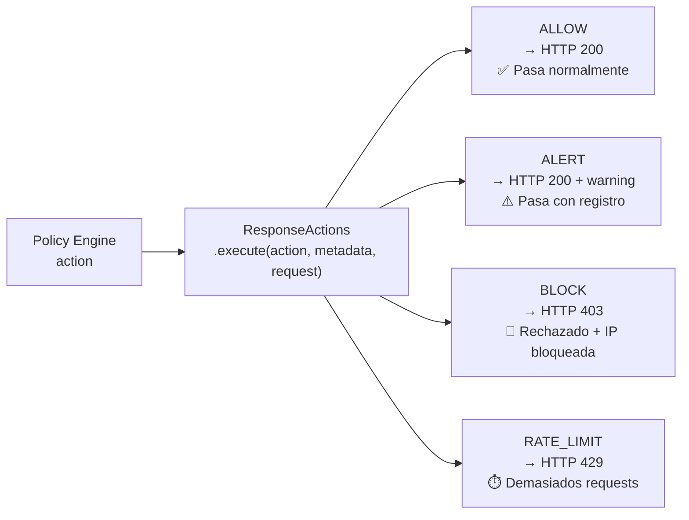

# Response Actions — Capa C5

Módulo que **ejecuta físicamente** las acciones que decide el [[Policy Engine]] en [[AthenAI]].

> [!INFO] Idea central
> El [[Policy Engine]] decide qué hay que hacer (ALLOW, ALERT, BLOCK, RATE_LIMIT). El `ResponseActions` es quien lo hace realmente: bloquea la IP en Redis, envía la notificación SNS, añade los headers de advertencia, devuelve el HTTP response correcto.

---

## Archivo

`athenai-dashboard/response_actions.py`

---

## Las 4 acciones disponibles



---

## Detalle de cada acción

### ✅ ALLOW — Permitir

```
Condición:   risk_score < 25
HTTP:        200 OK
Qué hace:    Log en consola + contador de stats
No hace:     Nada especial — el request pasa normal
```

```json
{
  "status": "allowed",
  "message": "Request processed successfully",
  "risk_score": 12.3,
  "timestamp": "2026-05-11T03:20:00Z"
}
```

---

### ⚠️ ALERT — Alertar (pero dejar pasar)

```
Condición:   25 ≤ risk_score < 50
HTTP:        200 OK (con headers extra)
Qué hace:    Log de warning + notificación SNS (si notify=True en metadata)
Headers añadidos:
  X-AthenAI-Warning: Suspicious activity detected
  X-AthenAI-Risk-Score: 38.7
```

> [!NOTE] ¿Por qué dejar pasar si es sospechoso?
> Con risk_score entre 25 y 50, la probabilidad de ser un falso positivo es considerable. Bloquear tráfico legítimo daña la experiencia del usuario. La alerta permite que un analista revise y decida manualmente.

---

### 🚫 BLOCK — Bloquear

```
Condición:   50 ≤ risk_score < 75
HTTP:        403 Forbidden
Qué hace:
  1. ip_blocker.block_ip(ip, duration, reason)  → Redis blocklist con TTL
  2. alert_system.send_alert(...)                → notificación SNS
  3. Log del evento con nivel ERROR
```

```json
{
  "status": "blocked",
  "message": "Access denied - Security threat detected",
  "reason": "SQL Injection",
  "risk_score": 67.4,
  "block_info": "Unblocked at 2026-05-11T04:20:00Z"
}
```

La duración del bloqueo viene en `metadata['block_duration']` (default: 3600 segundos = 1 hora).

---

### ⏱️ RATE_LIMIT — Límite de velocidad

```
Condición:   Demasiados requests en poco tiempo (C2 lo decide)
HTTP:        429 Too Many Requests
Headers añadidos:
  Retry-After: 60
  X-RateLimit-Limit: 100
  X-RateLimit-Remaining: 0
```

> [!TIP] Diferencia entre BLOCK y RATE_LIMIT
> - **BLOCK**: el request es malicioso → se bloquea la IP hasta que expire el TTL
> - **RATE_LIMIT**: el request puede ser legítimo pero hay demasiados → se le dice que espere y reintente

---

## Dependencias e integración

```python
# response_actions.py
class ResponseActions:
    def __init__(self, alert_system=None, ip_blocker=None):
        # Si no se pasan, los importa automáticamente:
        from alert_system import alert_system   # → SNS (LocalStack)
        from ip_blocker import ip_blocker       # → Redis blocklist
```

Si alguna dependencia no está disponible (LocalStack caído, Redis no conecta), el sistema **no falla** — simplemente omite esa acción y loguea el error. El HTTP response sigue siendo el correcto.

---

## Estadísticas acumuladas

```python
response_actions.get_stats()
# {
#   "total_actions": 45230,
#   "allowed": 41200,
#   "alerted": 2100,
#   "blocked": 1800,
#   "rate_limited": 130,
#   "percentages": {
#     "allowed": 91.1,
#     "alerted": 4.6,
#     "blocked": 3.9,
#     "rate_limited": 0.3
#   }
# }
```

---

## Flujo completo desde el endpoint

```python
# api_backend.py — /api/security/analyze
action, metadata = policy_engine.make_decision(risk_score, source_ip, attack_type)

response, status_code = response_actions.execute(
    action.value,      # "ALLOW" / "ALERT" / "BLOCK" / "RATE_LIMIT"
    metadata,          # {"severity": "high", "block_duration": 3600, ...}
    {
        'source_ip': source_ip,
        'risk_score': risk_score,
        'attack_type': attack_type,
        'method': method,
        'path': path,
        'payload': payload
    }
)
return response, status_code
```

---

## Ver también

- [[Policy Engine]] — Decide qué acción ejecutar
- [[Base de Datos]] — DynamoDB registra el resultado después de la acción
- [[Arquitectura]] — Capa C5 en el diagrama del sistema
- [[AthenAI]] — Flujo completo de una petición
