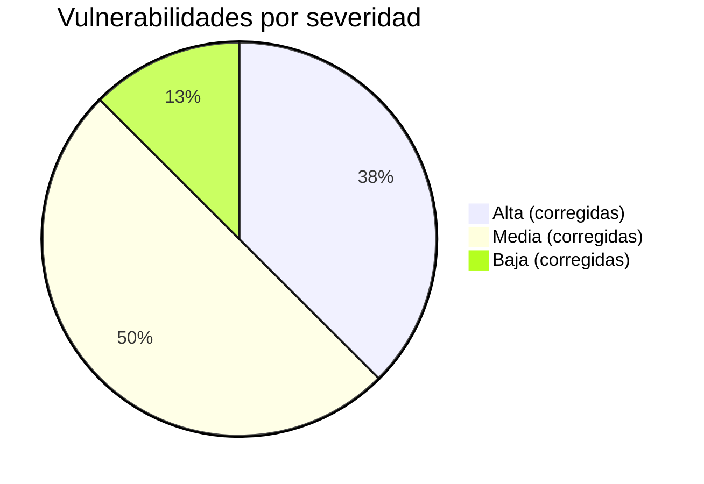

# Seguridad — Vulnerabilidades y Parches

Registro completo de hallazgos del pentest y las correcciones aplicadas en [[AthenAI]].

> [!SUCCESS] Estado final
> Las 16 vulnerabilidades identificadas (V-01 a V-12 + V-NEW-01, V-NEW-02) han sido corregidas y verificadas con pruebas de sintaxis y smoke tests.

---

## Resumen por severidad



---

## Tabla completa de vulnerabilidades

| ID | Descripción corta | Severidad | Archivo afectado | Estado |
|----|-------------------|-----------|-----------------|--------|
| V-01 | Werkzeug dev server en producción | 🔴 Alta | `wsgi.py`, `gunicorn.conf.py` | ✅ |
| V-02 | Sin validación de entrada en endpoints | 🔴 Alta | `validators.py`, `api_backend.py` | ✅ |
| V-03 | JWT sin claims de seguridad (iss/aud/jti/nbf) | 🔴 Alta | `auth_service.py` | ✅ |
| V-04 | CORS sin `supports_credentials=False` explícito | 🟡 Media | `api_backend.py` | ✅ |
| V-05 | Oracle de formato en validación de login | 🟡 Media | `validators.py` | ✅ |
| V-06 | Headers de seguridad HTTP ausentes | 🟡 Media | `api_backend.py` | ✅ |
| V-07 | Contraseña sin requisitos de complejidad | 🟡 Media | `validators.py` | ✅ |
| V-08 | X-Forwarded-For no validado (XFF spoofing) | 🔴 Alta | `api_backend.py` | ✅ |
| V-09 | Dependencias sin versiones fijas | 🔵 Baja | `requirements.txt` | ✅ |
| V-10 | CORS sin header `Vary: Origin` | 🔵 Baja | `api_backend.py` | ✅ |
| V-11 | Registro de usuarios sin rate limit | 🟡 Media | `api_backend.py` | ✅ |
| V-12a | `source_ip` inyectable desde body del cliente | 🔴 Alta | `api_backend.py` | ✅ |
| V-12b | Sin límite de tamaño de payload en `/analyze` | 🟡 Media | `validators.py` | ✅ |
| V-12c | `endpoint_name` arbitrario en `/ml/predict` | 🔴 Alta | `validators.py` | ✅ |
| V-NEW-01 | Timing oracle en autenticación | 🔴 Alta | `auth_service.py` | ✅ |
| V-NEW-02 | Email duplicado en registro sin verificación | 🟡 Media | `auth_service.py` | ✅ |

---

## Explicación de los parches más importantes

### V-01 — Werkzeug dev server

**Problema:** Flask incluye un servidor web de desarrollo (Werkzeug) que no es seguro ni eficiente para producción. Expone el debugger interactivo.

**Solución:** Creados `wsgi.py` y `gunicorn.conf.py`. El comando de producción es:
```bash
gunicorn -c gunicorn.conf.py wsgi:app
```
Ver [[Infraestructura]] para detalles.

---

### V-03 — JWT sin claims de seguridad

**Problema:** Los tokens JWT solo tenían `sub` y `exp`. Sin `iss` y `aud`, un token de otro servicio podría usarse aquí ("token confusion attack").

**Solución:**
```python
# auth_service.py — generate_access_token()
payload = {
    'iss': 'athenai',
    'aud': 'athenai-dashboard',
    'jti': secrets.token_urlsafe(16),  # ID único
    'nbf': now,
    'iat': now,
    'exp': now + timedelta(minutes=15),
    'sub': user_id,
    'role': role
}
```

---

### V-05 — Oracle de formato en login

**Problema:** Si `LoginSchema` validaba la complejidad de la contraseña (regex), un atacante podía enviar contraseñas que fallaran la validación (422) vs. que pasaran pero fueran incorrectas (401). Esto revelaba información sobre el formato esperado.

**Solución:** `LoginSchema.password` solo valida `min=1, max=128`. Sin regex. El 422 nunca revela si el "formato" fue correcto.

```python
# validators.py
class LoginSchema(Schema):
    password = fields.String(
        required=True,
        validate=validate.Length(min=1, max=128)
        # SIN regex — no hay oracle de formato
    )
```

---

### V-08 — X-Forwarded-For spoofing

**Problema:** Sin ProxyFix, `request.remote_addr` podía ser manipulado por el header `X-Forwarded-For`. Un atacante podía poner `X-Forwarded-For: 127.0.0.1` y saltarse el rate limiter (que bloqueaba por IP).

**Solución:**
```python
# api_backend.py
TRUSTED_PROXY_HOPS = int(os.getenv('TRUSTED_PROXY_HOPS', '0'))
if TRUSTED_PROXY_HOPS > 0:
    app.wsgi_app = ProxyFix(app.wsgi_app,
                            x_for=TRUSTED_PROXY_HOPS,
                            x_proto=1, x_host=1)

def _client_ip():
    return request.remote_addr  # siempre IP real después de ProxyFix
```

---

### V-NEW-01 — Timing Oracle

**Problema:** Si el servidor respondía en 50ms cuando el usuario no existía (omitía bcrypt) y en 350ms cuando sí existía (calculaba bcrypt), un atacante podía enumerar usuarios válidos midiendo tiempos.

**Solución:** Siempre calcular bcrypt, independientemente de si el usuario existe:
```python
_DUMMY_BCRYPT_HASH = bcrypt.hashpw(b"dummy_constant", bcrypt.gensalt())

if user is None:
    bcrypt.checkpw(password.encode(), _DUMMY_BCRYPT_HASH)  # mismo tiempo
    return None
```

---

### V-12a — source_ip inyectable

**Problema:**
```python
# ANTES (vulnerable) — api_backend.py:2029
source_ip = data.get('source_ip', request.remote_addr)
# Un atacante autenticado podía pasar "source_ip": "127.0.0.1"
# y el Policy Engine pensaría que el request venía de localhost
```

**Solución:**
```python
# DESPUÉS (corregido)
source_ip = _client_ip()  # siempre socket real, cliente no puede influir
```

---

### V-12b y V-12c — Validación de /analyze y /ml/predict

**V-12b:** `AnalyzeRequestSchema` en `validators.py`:
- `payload` máximo **10 KB** (evita DoS al motor ML)
- `method` debe ser uno de: GET, POST, PUT, PATCH, DELETE, HEAD, OPTIONS
- `path` máximo 2048 chars, sin caracteres de control

**V-12c:** `MLPredictSchema` en `validators.py`:
- `endpoint_name` debe estar en el allowlist:
  - `threat-detector-prod`
  - `threat-detector-staging`
  - `anomaly-detector-prod`
- Cualquier otro nombre → 422 Unprocessable Entity

---

## Ver también

- [[Auth Service]] — Detalles de V-03, V-05, V-07, V-NEW-01, V-NEW-02
- [[API Backend]] — Detalles de V-01, V-04, V-06, V-08, V-10, V-11
- [[Policy Engine]] — Detalles de V-12a, V-12b
- [[Infraestructura]] — V-01 (Gunicorn)
- [[AthenAI]] — Vista general del sistema
